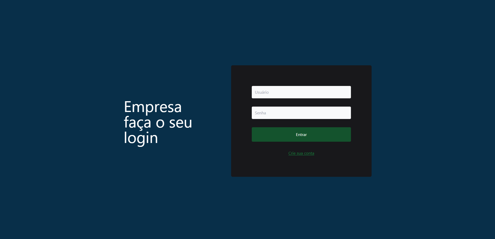
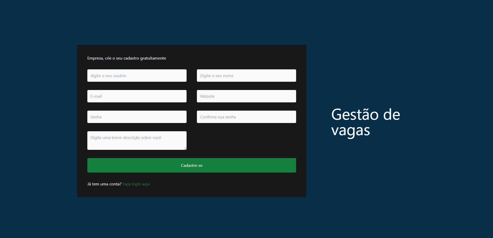
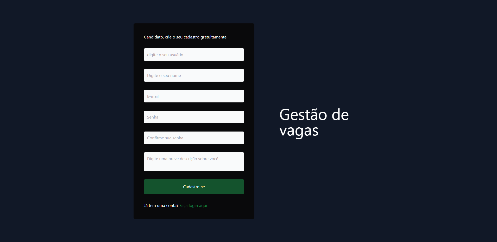
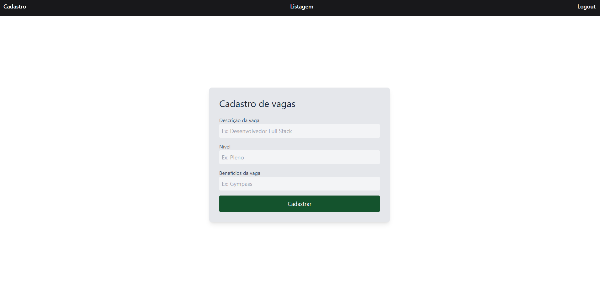
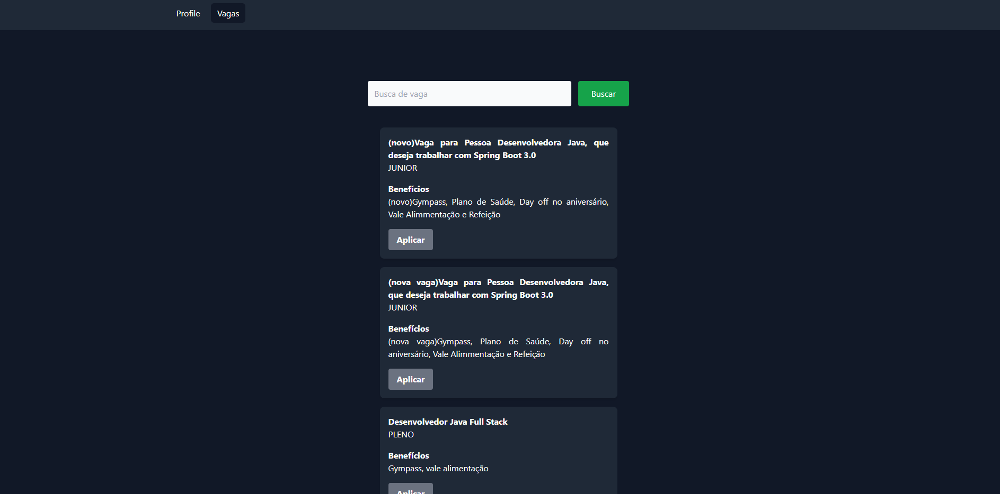
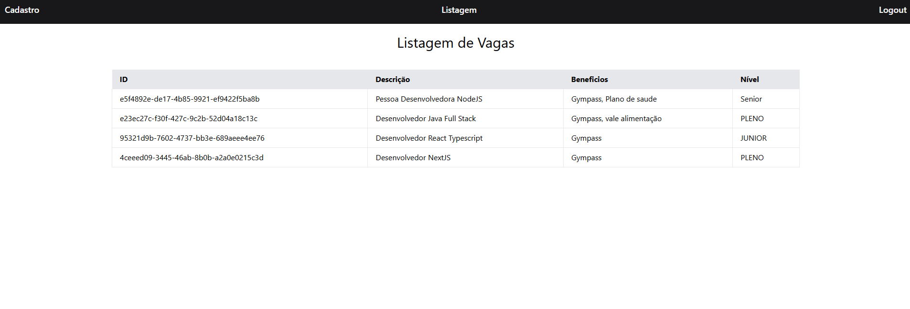

# gestao_vagas_java_frontend

Aplicação front-end conectada com back-end utilizando Java e Spring Boot Framework,
é uma plataforma de vagas de emprego tipo o linkedin, aonde o candidato e a empresa podem se cadastrar, serão autenticados e a empresa pode criar vagas de emprego e o candidato pode pesquisar por vagas de emprego e aplicar.

